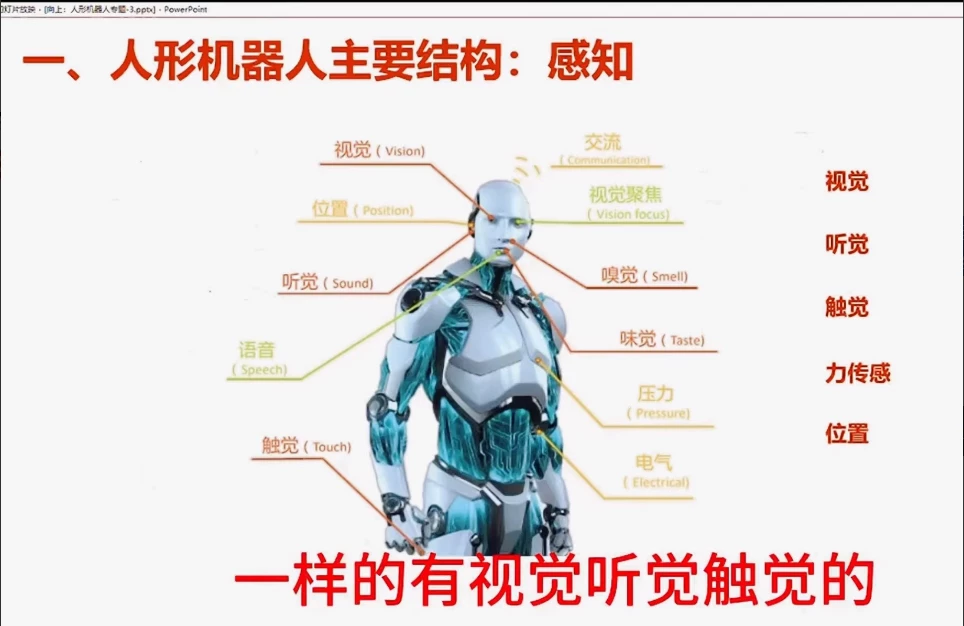
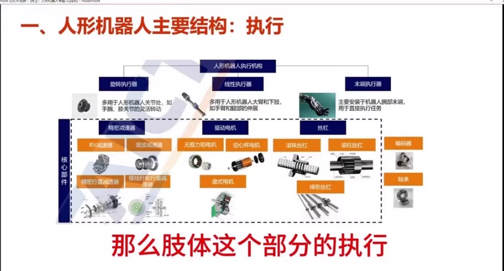
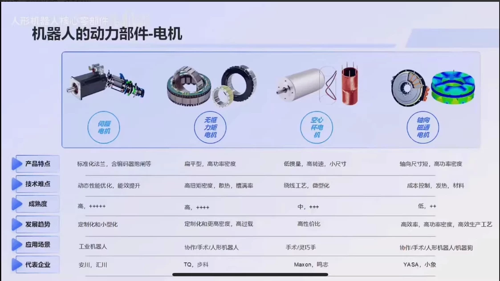
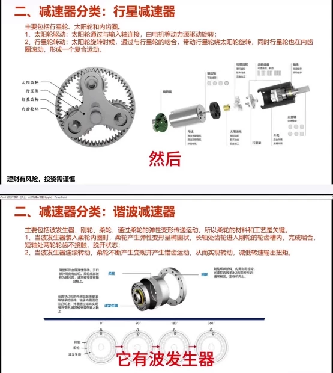
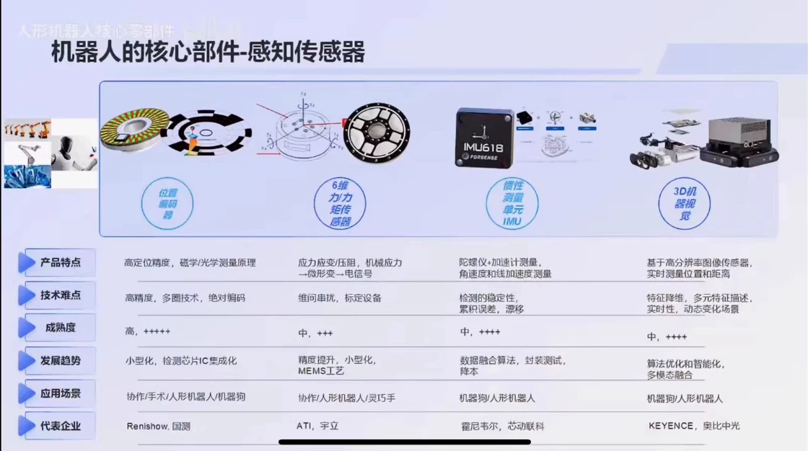

# Humanoid Robotics Beginner Course - 20 Lectures

1. Introduction to Humanoid Robotics
- What is a humanoid robot?
- Why are humanoid robots important?
- The history of humanoid robotics

2. Basic Concepts of Humanoid Robotics
- What is a robot?
- What is a humanoid robot?
- What is the difference between a humanoid robot and a non-humanoid robot?

3. Designing a Humanoid Robot
- What are the key components of a humanoid robot?
- How do you design a humanoid robot?
- What are some common design challenges for humanoid robots?

4. Mechanical Design of a Humanoid Robot
- What are the different types of mechanical systems used in humanoid robots?
- How do you design a humanoid robot's body?
- What are some common mechanical design challenges for humanoid robots?

5. Electrical Design of a Humanoid Robot
- What are the different types of electrical systems used in humanoid robots?
- How do you design a humanoid robot's motors?
- What are some common electrical design challenges for humanoid robots?

6. Sensory Systems of a Humanoid Robot
- What are the different types of sensory systems used in humanoid robots?
- How do you design a humanoid robot's sensors?
- What are some common sensory design challenges for humanoid robots?

7. Control System of a Humanoid Robot
- What are the different types of control systems used in humanoid robots?
- How do you design a humanoid robot's controllers?
- What are some common control system design challenges for humanoid robots?

8. Software Development for a Humanoid Robot
- What are the different types of software systems used in humanoid robots?
- How do you develop software for a humanoid robot?
- What are some common software development challenges for humanoid robots?

9. Testing and Verification of a Humanoid Robot
- What are the different types of testing methods used in humanoid robots?
- How do you verify the performance of a humanoid robot?
- What are some common testing and verification challenges for humanoid robots?

10. Safety and Ethical Considerations in Humanoid Robotics
- What are the ethical considerations involved in using humanoid robots?
- How do you ensure the safety of humanoid robots?
- What are some common safety and ethical challenges in humanoid robotics?

11. Case Studies of Successful Humanoid Robot Applications
- What are some examples of successful humanoid robot applications?
- How did these applications achieve their goals?
- What are some lessons learned from these successful applications?

12. Challenges and Opportunities in Humanoid Robotics
- What are some of the biggest challenges facing humanoid robotics today?
- What are some opportunities for future advancements in humanoid robotics?
- What are some potential solutions to these challenges and opportunities?

13. Future Trends in Humanoid Robotics
- What are some of the latest trends in humanoid robotics?
- How will these trends impact the future of humanoid robotics?
- What are some predictions for the future of humanoid robotics?

## Body

Humanoid Robotics Beginner's Course - 20 Lectures

This course is designed for beginners who want to learn about humanoid robotics. It covers the overall structure of a humanoid robot, motors, and battery packs.

1. Introduction to Humanoid Robotics
- What is a humanoid robot?
- Why are humanoid robots important?
- Who are the main players in the field of humanoid robotics?

2. The Overall Structure of a Humanoid Robot
- What is the overall structure of a humanoid robot?
- How do we build a humanoid robot?
- What are the different parts of a humanoid robot?

3. Motors
- What is a motor?
- How do we control a motor?
- What are the different types of motors?

4. Battery Packs
- What is a battery pack?
- How do we power a humanoid robot?
- What are the different types of batteries?

5. Sensors
- What are sensors?
- How do we use sensors to control a humanoid robot?
- What are the different types of sensors?

6. Control Systems
- What is a control system?
- How do we control a humanoid robot?
- What are the different types of control systems?

7. Software Development
- What is software development?
- How do we develop software for a humanoid robot?
- What are the different types of software development tools?

8. Hardware Development
- What is hardware development?
- How do we develop hardware for a humanoid robot?
- What are the different types of hardware development tools?

9. Assembly and Testing
- How do we assemble a humanoid robot?
- How do we test a humanoid robot?
- What are the different types of testing methods?

10. Safety and Maintenance
- What are the safety considerations when working with a humanoid robot?
- How do we maintain a humanoid robot?
- What are the different types of maintenance procedures?

11. Challenges and Opportunities
- What are some of the challenges facing humanoid robotics today?
- What are some of the opportunities for humanoid robotics in the future?

12. Case Studies
- What are some successful case studies in humanoid robotics?
- What are some examples of failures in humanoid robotics?

13. Future Directions
- What are some of the future directions in humanoid robotics?
- What are some of the potential applications for humanoid robotics?

14. Interactive Learning
- How can we make this course more interactive?
- What are some ways we can engage our students in this course?

15. Conclusion
- What are some key takeaways from this course?
- What are some recommendations for further learning in this area?

(Full product description was not available from the source page.)

## Images

## Payment

Here is a pay link on Stripe ( https://buy.stripe.com/3cs8yP7sY87d0vu9AB ). Please contact me lonlonago@foxmail.com after funding $89, and I will send you a complete data files , thank you!

